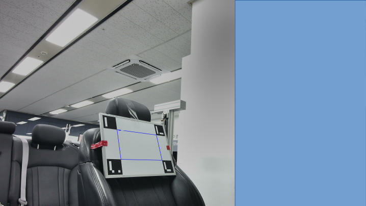
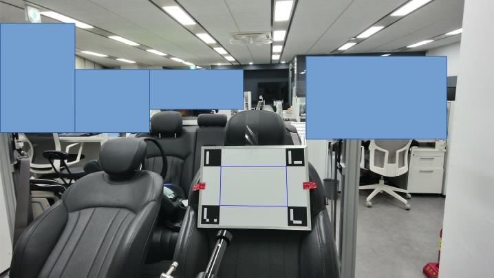
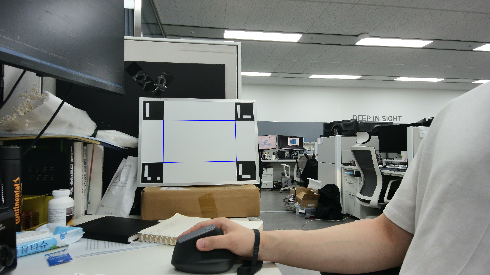
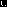
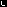

# Orbbec Multi-Camera Checkerboard Calibration System

OrbbecSDK를 사용하여 여러 대의 RGB-D 카메라를 코너 네 곳 Aruco Marker 캘리브레이션을 통해 하나의 좌표계로 통합하는 프로그램입니다.






## 주요 기능

1. **다중 카메라 디바이스 관리**
   - 연결된 모든 Orbbec 카메라 자동 감지
   - 개별 또는 모든 카메라 순차 처리 가능

2. **깊이 데이터 평균화 (Depth Frame Averaging)**
   - 20, 30, 40 프레임으로 여러 번 평균화
   - 표준편차 기반 노이즈 필터링 (20% 임계값)
   - 중복 포인트 제거 후 하나의 포인트 클라우드로 병합

3. **Aruco Marker Target 검출 및 캘리브레이션**
   - Color image에서 4개의 Aruco marker 검출
   - 각 마커 중점 3차원 좌표 획득
   - SVD에 활용

4. **SVD 기반 변환 행렬 계산**
   - 첫 번째 카메라를 기준 좌표계로 설정
   - 각 카메라의 4x4 변환 행렬 계산
   - RMSE 오차 계산 및 검증

## 빌드 방법

### 필수 라이브러리
- OrbbecSDK
- OpenCV (>= 4.0)
- Eigen3
- PCL (Point Cloud Library >= 1.7)
- CMake (>= 3.1.15)

Ubuntu/Debian 기반 시스템에서는 다음 명령어로 PCL을 설치할 수 있습니다:
```bash
sudo apt-get update && sudo apt-get install -y libpcl-dev
```

### 빌드 단계

```bash
cd /root/yeonsoo/OrbbecSDK/examples/cpp/Mean_pcd
mkdir build
cd build
cmake ..
make -j$(nproc)
```

## 실행 방법


### 프로그램 실행
```bash
./Mean_pcd
```

## 사용법

프로그램 실행 후 다음 명령어를 사용할 수 있습니다:

- **[0-N]** : 해당 인덱스의 디바이스 개별 처리
- **a** : 모든 디바이스 순차 처리
- **c** : 수집된 데이터로 변환 행렬 계산
- **q** : 프로그램 종료

### 캘리브레이션 프로세스

1. 모든 카메라가 동일한 Aruco Marker Target을 바라보도록 설치
2. 프로그램 실행 후 'a' 입력으로 모든 디바이스 데이터 수집
3. 또는 디바이스 인덱스 직접 입력
4. 'c' 입력으로 획득한 데이터로 변환 행렬 계산

## 출력 파일

### 포인트 클라우드 파일
- `MeanPointCloud_[SerialNumber].ply` : 평균화된 RGB 포인트 클라우드

### 이미지 파일
- `ColorImage_[SerialNumber].png` : 캡처된 컬러 이미지

### 변환 행렬 파일
- `Transform_[Source]_to_[Target].txt` : 카메라 간 변환 행렬
  - 4x4 변환 행렬 (회전 + 이동)
  - RMSE 오차 정보 포함

## 타겟보드 사양
- 정반사 되지 않는 흰색의 평평한 보드 사용

- 코너 네곳 Top left, Top right, Bottom left, Bottom right 순서로 ID-0,1,2,3 부착

- 
- 
- 
- 
- 정사각형 크기: 상관 없음

## 기술적 세부사항

### 좌표계 변환
- SVD(Singular Value Decomposition)를 사용한 최적 변환 계산
- 반사 보정 처리 포함
- 중심점 정렬 후 회전 및 이동 계산

### 노이즈 필터링
- 각 픽셀별 평균 및 표준편차 계산
- 표준편차가 평균의 20% 이하인 경우만 유효 데이터로 처리
- 중복 포인트 제거 (0.01mm 정밀도)

### 프레임 평균화
- 20, 30, 40 프레임으로 3단계 평균화
- 각 단계별 독립적인 통계 계산
- 최종적으로 모든 단계의 포인트 클라우드 병합

## 주의사항

1. 모든 카메라가 체커보드 전체를 명확하게 볼 수 있어야 함
2. 체커보드는 평평하고 고정된 상태여야 함
3. 카메라와 체커보드 간 적절한 거리 유지 필요

## 문제 해결

### Aruco Marker 4개를 찾을 수 없는 경우
- 조명 상태 확인
- 모든 Aruco marker가 카메라 시야에 완전히 포함되는지 확인
- Aruco marker 표면이 평평한지 확인

### 변환 행렬 RMSE가 큰 경우
- 체커보드 검출이 모든 카메라에서 정확한지 확인
- 카메라가 진동하지 않는지 확인
- 더 많은 프레임으로 평균화 시도

### 라이브러리 로드 실패
- LD_LIBRARY_PATH 환경 변수 확인
- OrbbecSDK 라이브러리 경로 확인

### transform_ply.py 사용법
- 변환이 올바른지 시각화 하기 위한 파이썬 파일
- open3d 설치 필요
```bash
python3 transform_ply.py <ply_file_to_transformation.ply> <Transform_A_to_B_result.txt>
```